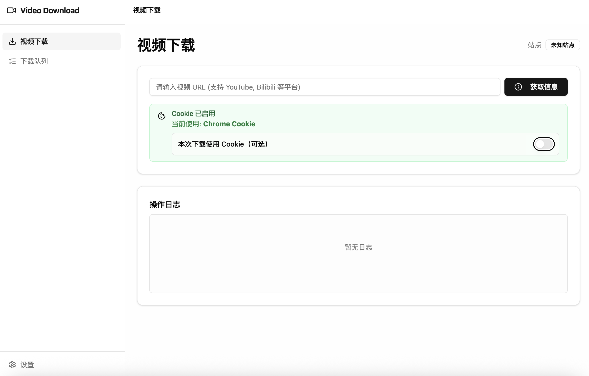
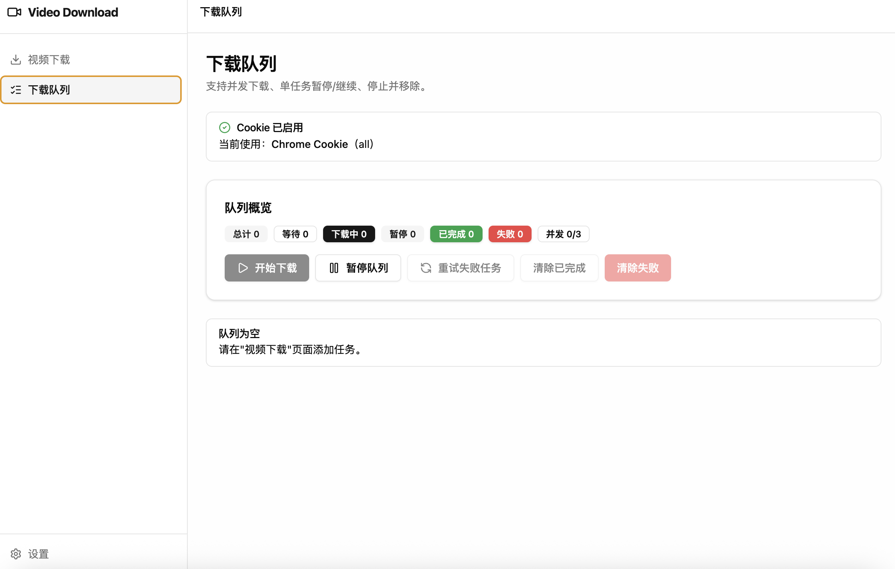
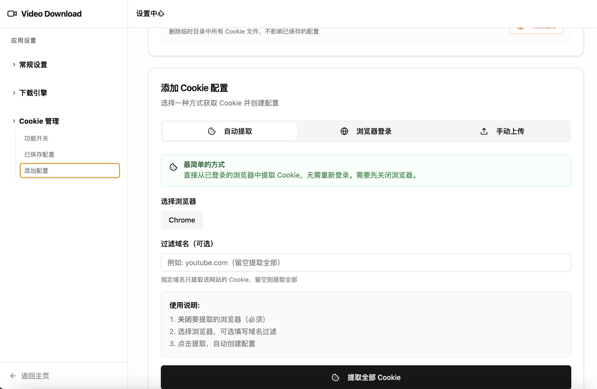

# Video Downloader

基于 Electron + React + Radix UI 的现代化视频下载器，使用 yt-dlp 和 ffmpeg。

## 截图预览

| 视频下载 | 下载队列 | 设置中心 |
|:---:|:---:|:---:|
|  |  |  |

## 功能特性

### 视频下载
- 支持多平台视频下载（YouTube、Bilibili 等）
- 自动获取视频信息（标题、上传者、时长）
- 多种格式选择（视频/音频）
- 播放列表/频道批量下载
- 实时下载进度显示

### 下载队列
- 批量下载管理
- 并发下载控制（可配置 1-10 个并发）
- 任务状态追踪（等待、下载中、已完成、失败）
- 失败任务自动重试
- 一键清理已完成/失败任务

### Cookie 管理
- 浏览器 Cookie 自动提取（Chrome、Edge、Brave 等）
- Bilibili 扫码登录
- Cookie 文件导入
- 解决 403/登录限制问题

### 系统设置
- 默认下载路径配置
- 最大并发数设置
- yt-dlp 高级参数配置
- 组件状态检查与更新

## 快速开始

### 安装依赖
```bash
npm install
```

### 下载二进制文件

二进制文件（yt-dlp、ffmpeg）不包含在 Git 仓库中，克隆后需要手动下载：

```bash
# 自动下载当前平台的二进制文件
npm run download-binaries
```

脚本会自动检测操作系统并下载对应版本到 `binaries/<platform>/` 目录。

手动下载地址：
- **yt-dlp**: https://github.com/yt-dlp/yt-dlp/releases
- **ffmpeg**: https://ffmpeg.org/download.html

下载后放入对应平台目录：
- macOS: `binaries/darwin/`
- Windows: `binaries/win32/`
- Linux: `binaries/linux/`

### 开发模式
```bash
npm run dev
```

### 构建应用
```bash
npm run build
```

### 打包

```bash
# 完整版（包含 yt-dlp + ffmpeg）
npm run dist:full

# 精简版（不含二进制文件，需用户自行安装或在应用内下载）
npm run dist:lite

# 同时打包两个版本
npm run dist:all
```

## 技术栈

- **前端框架**: React 19 + TypeScript 5
- **UI 组件**: Radix UI + Tailwind CSS
- **状态管理**: Zustand
- **构建工具**: Vite 7
- **桌面框架**: Electron 27
- **下载引擎**: yt-dlp + ffmpeg

## 项目结构

```
video-download-electron/
├── config/               # 配置文件
│   ├── vite.config.ts
│   ├── vitest.config.ts
│   ├── tailwind.config.js
│   ├── postcss.config.js
│   ├── electron-builder.full.json
│   └── electron-builder.lite.json
├── src/
│   ├── electron/         # Electron 主进程
│   │   ├── main.ts
│   │   ├── preload.ts
│   │   ├── ipc/          # IPC 处理器
│   │   ├── services/     # 业务服务
│   │   ├── lib/          # 工具库
│   │   └── window/       # 窗口管理
│   ├── components/       # React 组件
│   ├── pages/            # 页面组件
│   ├── store/            # Zustand 状态
│   ├── shared/           # 共享类型定义
│   └── lib/              # 前端工具
├── binaries/             # 二进制文件（完整版）
│   ├── darwin/
│   ├── win32/
│   └── linux/
├── index.html
├── package.json
├── tsconfig.json
└── README.md
```

## 打包说明

### 完整版 vs 精简版

| 版本 | 包含内容 | 体积 | 适用场景 |
|------|---------|------|---------|
| 完整版 | yt-dlp + ffmpeg | 较大 | 开箱即用 |
| 精简版 | 仅应用本体 | 较小 | 用户自行安装依赖或应用内下载 |

精简版用户可以：
1. 自行安装 yt-dlp 和 ffmpeg 到系统 PATH
2. 在应用「设置」页面点击下载按钮，自动从 GitHub 下载

## 常见问题

### HTTP 403 错误
使用 Cookie 功能解决：
1. 进入「Cookie 管理」页面
2. 选择浏览器自动提取 Cookie
3. 或使用 Bilibili 扫码登录

### yt-dlp 未找到
- 完整版：检查 binaries 目录
- 精简版：在设置页面点击「下载 yt-dlp」

### 下载速度慢
在设置页面的「高级参数」中配置代理：
```
--proxy socks5://127.0.0.1:1080
```

## 许可证

MIT License

## 致谢

- [yt-dlp](https://github.com/yt-dlp/yt-dlp) - 强大的视频下载工具
- [ffmpeg](https://ffmpeg.org/) - 音视频处理库
- [Radix UI](https://www.radix-ui.com/) - 无障碍 UI 组件
- [Electron](https://www.electronjs.org/) - 跨平台桌面应用框架
